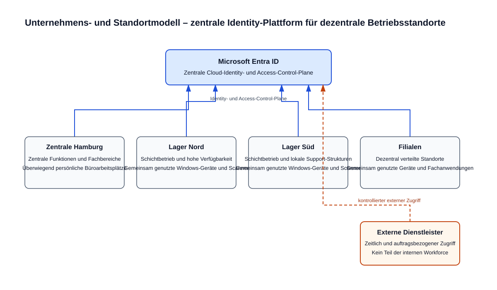

# Unternehmensszenario

## Nordstern Handelsgruppe GmbH

Die Nordstern Handelsgruppe ist ein fiktives deutsches Handelsunternehmen mit zentraler Verwaltung und dezentralen Betriebsstandorten.

## Standorte

### Zentrale Hamburg

Funktionen:

- Geschäftsführung
- Einkauf
- Finanzen
- HR
- IT
- Informationssicherheit
- Vertrieb
- zentrale Administration

### Lager Nord

Großer Logistikstandort für Norddeutschland.

Besonderheiten:

- Schichtbetrieb
- viele gemeinsam genutzte Windows-Endgeräte
- Scanner / Spezialgeräte
- eingeschränkte lokale IT-Unterstützung
- hohe Verfügbarkeitsanforderung

### Lager Süd

Zweiter Logistikstandort.

Besonderheiten:

- vergleichbares Betriebsmodell wie Lager Nord
- eigenständige lokale Support-Strukturen
- Pilotstandort für neue Identity- und Device-Standards möglich

### Filialen

Dezentral verteilte Standorte mit:

- Marktleitung
- Mitarbeitenden
- gemeinsam genutzten Geräten
- spezialisierten Fachanwendungen

## Personas

Die folgenden Personas beschreiben den fachlichen Kontext und die Sicherheitsanforderungen. Sie legen weder einen primären Source of Authority noch ein konkretes technisches Anmelde- oder Bereitstellungsmodell fest. Diese Entscheidungen sind in den jeweils nachgelagerten Tasks zu treffen.

### Office User – Zentrale Hamburg

Mitarbeitende der zentralen Funktionen wie Geschäftsführung, Einkauf, Finanzen, HR, IT, Informationssicherheit und Vertrieb. Sie arbeiten überwiegend an persönlichen Büroarbeitsplätzen und benötigen Zugriff auf zentrale Kollaborations- und Fachanwendungen.

### Warehouse User – Lager Nord

Logistikmitarbeitende im Schichtbetrieb. Der Standort nutzt viele gemeinsam genutzte Windows-Endgeräte sowie Scanner und weitere Spezialgeräte; die lokale IT-Unterstützung ist eingeschränkt. Zugriffe müssen deshalb auch bei Gerätewechsel und in betrieblich zeitkritischen Abläufen nachvollziehbar bleiben.

### Warehouse User – Lager Süd

Logistikmitarbeitende in einem dem Lager Nord vergleichbaren Betriebsmodell. Die eigenständigen lokalen Support-Strukturen und die mögliche Rolle als Pilotstandort sind bei späteren Device- und Identity-Standards zu berücksichtigen, ohne für diese Persona vorzugreifen.

### External Contractor

Externe Dienstleister mit auftrags- und zeitgebundenem Zugriff auf die jeweils benötigten Ressourcen. Ihre Identitätsquelle und das Modell für die Zusammenarbeit mit externen Identitäten sind noch nicht entschieden.

### Store User – Filialen

Mitarbeitende und Marktleitungen an dezentralen Filialstandorten. Sie verwenden teilweise gemeinsam genutzte Geräte und spezialisierte Fachanwendungen; die Anforderungen an Nachvollziehbarkeit und minimale Berechtigungen gelten standortunabhängig.

### Privileged Administrator

Personen mit administrativen Aufgaben in IT oder Informationssicherheit. Administrative Tätigkeiten erfolgen gemäß Zielarchitektur mit separaten administrativen Identitäten, stärkerer Authentifizierung und restriktiven Zugriffsbedingungen.

### Emergency Access Administrator

Nur für den Notfall vorgesehene administrative Identitäten. Ihre Nutzung ist streng zu überwachen; sie werden gezielt von regulären Conditional-Access-Policies ausgenommen. Das konkrete Emergency-Access-Design wird erst in `CA-003` festgelegt.

Die detaillierte Beschreibung der organisatorischen, technischen und Lifecycle-Anforderungen je Persona befindet sich in [PERSONAS.md](../concepts/PERSONAS.md).

## Unternehmens- und Standortmodell

Das Diagramm zeigt die zentrale Verwaltung, die dezentralen Betriebsstandorte und externe Dienstleister im Verhältnis zur zentralen Identity-Plattform.

## Kernanforderungen

- einheitliche Identitätsplattform
- standardisierte Authentifizierung
- minimale privilegierte Rechte
- nachvollziehbarer User Lifecycle
- sichere Integration von Anwendungen
- zentrale Governance
- kontrollierte Delegation
- Auditierbarkeit
