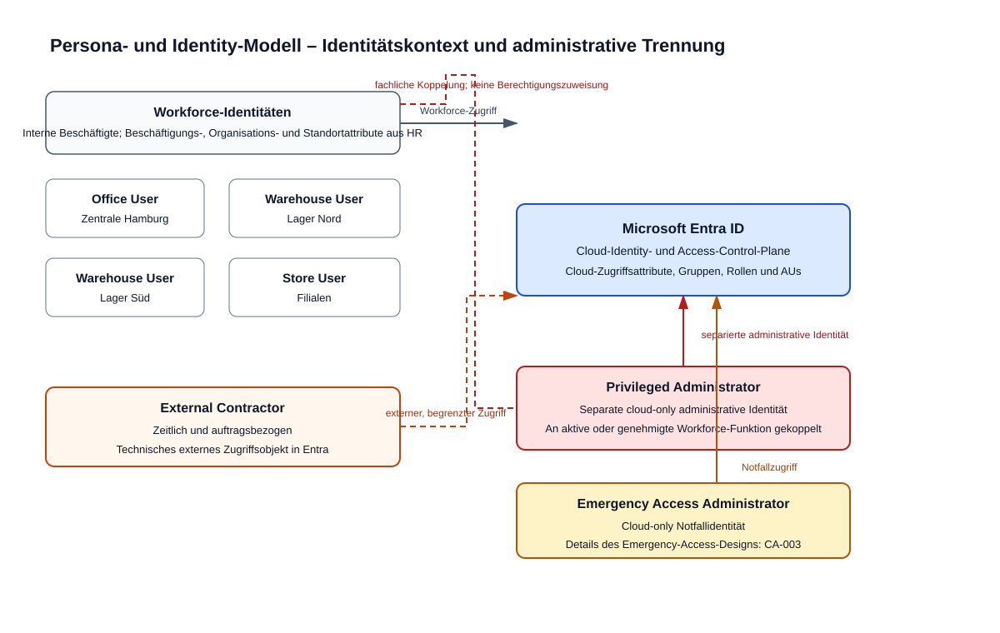

# Personas

Status: **Konkretisiert im fachlichen Entwurf (IAM-001)**

## Zweck und Abgrenzung

Dieses Dokument konkretisiert die fachlichen Anforderungen an die Personas der Nordstern Handelsgruppe. Es beschreibt keine produktive Tenant-Konfiguration und trifft keine Entscheidung über Source of Authority, konkrete Authentifizierungsmethoden, Gruppenimplementierung oder einzelne Conditional-Access-Policies.

Die Begriffe „Identity Source“ und „Berechtigungsmodell“ sind deshalb je Persona als fachlicher Bedarf und, wo erforderlich, als offene Architekturfrage dokumentiert. Die technische Festlegung ist nicht Bestandteil von `IAM-001`.

## Office User – Zentrale Hamburg

- **Organisatorischer Kontext:** Interne Mitarbeitende der zentralen Funktionen in Hamburg, darunter Einkauf, Finanzen, HR, IT, Informationssicherheit, Vertrieb und Geschäftsführung. Administrative Aufgaben sind keine Regelaufgabe dieser Persona.
- **Administrativer Kontext:** Diese Persona erhält keine administrativen Plattformrechte aus der Zugehörigkeit zur Zentrale. Erforderliche administrative Tätigkeiten gehören zur separaten Persona „Privileged Administrator“.
- **Identity Source:** Workforce-Identität. HR führt Beschäftigungs-, Organisations- und soweit vorhanden Standortattribute; AD ist bei Bedarf für technisch notwendige On-Premises-Kontoattribute authoritative, solange kein späteres Cloud-first-SoA-Modell dies ablöst; Entra führt Cloud-Zugriffsattribute gemäß [Source-of-Authority-Modell](../architecture/SOURCE-OF-AUTHORITY.md). Die Synchronisationstechnologie bleibt offen.
- **Typische Endgeräte:** Überwiegend persönliche Büroarbeitsplätze; ein verbindlicher Device-Management- und Compliance-Standard ist noch nicht entschieden.
- **Typische Anwendungen:** Kollaboration und Kommunikation sowie zentrale Fachanwendungen für die jeweilige Funktion, etwa Einkauf, Finanzen, HR oder Vertrieb.
- **Authentifizierungsanforderungen:** Standardisierte, für Büroarbeit geeignete Anmeldung mit zusätzlicher Absicherung entsprechend Risiko, Ressource und Gerätezustand. Konkrete Methoden und Authentication Strengths sind noch nicht festgelegt.
- **Berechtigungsmodell:** Fachliche Zugriffe nur für die jeweilige Funktion und Aufgabe nach Least Privilege. Die technische Abbildung über Gruppen, Attribute oder andere Zuweisungen ist in `IAM-002` noch offen.
- **Conditional-Access-Besonderheiten:** Die Persona ist Teil der allgemeinen Workforce-Betrachtung. Anforderungen an Geräte, Risiko und Ressource müssen bei späteren Policies berücksichtigt werden; neue Policies beginnen gemäß ADR-0002 zunächst in `report-only`.
- **Joiner/Mover/Leaver-Besonderheiten:** Eintritt, Funktionswechsel und Austritt müssen Änderungen an Fachzugriffen auslösen. Auslösendes System, Fristen und Automatisierungsgrad werden erst mit Source of Authority und JML-Prozess festgelegt.

## Warehouse User – Lager Nord

- **Organisatorischer Kontext:** Interne Logistikmitarbeitende im Schichtbetrieb am großen norddeutschen Logistikstandort. Die eingeschränkte lokale IT-Unterstützung und hohe Verfügbarkeitsanforderung prägen den Zugang zu Anwendungen.
- **Administrativer Kontext:** Die Nutzung der lokalen Support-Strukturen führt nicht automatisch zu administrativen Entra- oder Anwendungsrechten. Eine mögliche kontrollierte Delegation ist von `IAM-003` abhängig.
- **Identity Source:** Workforce-Identität. HR führt Beschäftigungs- und soweit vorhanden Standortdaten „Lager Nord“; AD ist für technisch notwendige On-Premises-Kontoattribute authoritative, solange kein späteres Cloud-first-SoA-Modell dies ablöst; Entra führt Cloud-Zugriffsattribute gemäß [Source-of-Authority-Modell](../architecture/SOURCE-OF-AUTHORITY.md). Die Synchronisationstechnologie bleibt offen.
- **Typische Endgeräte:** Gemeinsam genutzte Windows-Endgeräte, Scanner und weitere Spezialgeräte in Logistikbereichen.
- **Typische Anwendungen:** Logistik- und Lagerfachanwendungen sowie die für Schicht, Kommunikation und Support erforderlichen Anwendungen.
- **Authentifizierungsanforderungen:** Der Zugriff muss einer Person nachvollziehbar zugeordnet werden, auch bei wechselnden oder gemeinsam genutzten Endgeräten. Ein konkretes Anmelde- und Sitzungsmodell für Shared Devices und Scanner ist noch offen.
- **Berechtigungsmodell:** Zugriff entsprechend Logistikaufgabe, Standort und gegebenenfalls Schicht; nur die für die Tätigkeit notwendigen Rechte. Gruppen- und Attributmodell werden in `IAM-002` entschieden.
- **Conditional-Access-Besonderheiten:** Späte CA-Regeln müssen Shared Devices, Spezialgeräte und die betriebliche Verfügbarkeit berücksichtigen. Konkrete Ausnahmen, Gerätevorgaben und Rollout-Piloten sind nicht Teil dieser Persona-Definition; neue Policies starten gemäß ADR-0002 in `report-only`.
- **Joiner/Mover/Leaver-Besonderheiten:** Schicht-, Aufgaben- oder Standortwechsel können Zugriffe ändern. Beim Austritt sind die persönlichen Zugriffe auch dann zu entziehen, wenn gemeinsam genutzte Geräte weiterhin im Betrieb bleiben.

## Warehouse User – Lager Süd

- **Organisatorischer Kontext:** Interne Logistikmitarbeitende des zweiten Logistikstandorts mit grundsätzlich vergleichbarem Betriebsmodell wie Lager Nord und eigenständigen lokalen Support-Strukturen. Der Standort kann später Pilotstandort sein; daraus folgt für diese Persona noch keine technische Sonderregel.
- **Administrativer Kontext:** Eigenständiger lokaler Support begründet keine pauschalen administrativen Rechte. Ob und wie eine kontrollierte Delegation erfolgt, ist in `IAM-003` zu bewerten.
- **Identity Source:** Workforce-Identität. HR führt Beschäftigungs- und soweit vorhanden Standortdaten „Lager Süd“; AD ist für technisch notwendige On-Premises-Kontoattribute authoritative, solange kein späteres Cloud-first-SoA-Modell dies ablöst; Entra führt Cloud-Zugriffsattribute gemäß [Source-of-Authority-Modell](../architecture/SOURCE-OF-AUTHORITY.md). Die Synchronisationstechnologie bleibt offen.
- **Typische Endgeräte:** Gemeinsam genutzte Windows-Endgeräte, Scanner und weitere Spezialgeräte.
- **Typische Anwendungen:** Logistik- und Lagerfachanwendungen sowie Anwendungen für Schicht, Kommunikation und Support.
- **Authentifizierungsanforderungen:** Personenbezug und Nachvollziehbarkeit müssen trotz gemeinsamer Geräte und Schichtbetrieb erhalten bleiben. Das konkrete Anmelde- und Sitzungsmodell ist offen.
- **Berechtigungsmodell:** Rechte richten sich nach Logistikaufgabe, Standort und gegebenenfalls Schicht und folgen dem Least-Privilege-Prinzip. Die technische Zuweisungslogik ist in `IAM-002` noch nicht festgelegt.
- **Conditional-Access-Besonderheiten:** Anforderungen aus Shared Devices, Spezialgeräten und Verfügbarkeit sind bei der späteren Policy-Ausgestaltung zu bewerten. Eine eventuelle Pilotierung wird erst im Controlled-Rollout-Prozess entschieden; neue Policies beginnen in `report-only`.
- **Joiner/Mover/Leaver-Besonderheiten:** Bei Wechseln zwischen Lager Nord und Lager Süd sind standortbezogene Zugriffe überprüfbar anzupassen. Eintritt, Aufgabenwechsel und Austritt benötigen einen später zu definierenden JML-Auslöser.

## Store User – Filialen

- **Organisatorischer Kontext:** Interne Mitarbeitende und Marktleitungen in dezentralen Filialen. Die Persona umfasst keine zentrale Administration.
- **Administrativer Kontext:** Marktleitungs- oder lokale Organisationsaufgaben beinhalten keine administrativen Rechte auf die Identity-Plattform. Ein etwaiger Delegationsbedarf ist noch nicht bewertet.
- **Identity Source:** Workforce-Identität. HR führt Beschäftigungs-, Organisations- sowie soweit vorhanden Standort- und Filialdaten; AD ist für technisch notwendige On-Premises-Kontoattribute authoritative, solange kein späteres Cloud-first-SoA-Modell dies ablöst; Entra führt Cloud-Zugriffsattribute gemäß [Source-of-Authority-Modell](../architecture/SOURCE-OF-AUTHORITY.md). Die Synchronisationstechnologie bleibt offen.
- **Typische Endgeräte:** Gemeinsam genutzte Geräte in den Filialen sowie gegebenenfalls persönliche Geräte für Marktleitung oder organisatorische Aufgaben. Die genaue Geräteklassifizierung ist noch nicht festgelegt.
- **Typische Anwendungen:** Spezialisierte Filial- und Handelsfachanwendungen sowie die für Kommunikation und organisatorische Aufgaben notwendigen Anwendungen.
- **Authentifizierungsanforderungen:** Zugriffe müssen einer Person zuordenbar bleiben, insbesondere bei gemeinsam genutzten Geräten. Konkrete Anmeldemethoden für Filialgeräte sind noch zu entscheiden.
- **Berechtigungsmodell:** Berechtigungen orientieren sich an Aufgabe, Verantwortungsbereich und erforderlichen Fachanwendungen; Marktleitungsrechte sind von allgemeinen Filialrechten zu trennen. Die technische Modellierung wird in `IAM-002` geklärt.
- **Conditional-Access-Besonderheiten:** Standortverteilung und gemeinsam genutzte Geräte müssen in späteren CA-Bewertungen berücksichtigt werden. Es sind noch keine geräte- oder standortspezifischen Ausnahmen festgelegt; neue Policies starten in `report-only`.
- **Joiner/Mover/Leaver-Besonderheiten:** Wechsel zwischen Filialen, Wechsel zur Marktleitung und Austritte erfordern eine zeitnahe Überprüfung und Anpassung der Zugriffe. Autoritative Ereignisse und Fristen sind noch offen.

## External Contractor

- **Organisatorischer Kontext:** Externe Dienstleister mit zeitlich und auftragsbezogen begrenztem Zugriff. Der geschäftlich verantwortliche Bereich muss den Zugriff fachlich begründen und verantworten; ein konkretes Sponsor- oder Genehmigungsmodell wird hier nicht festgelegt.
- **Administrativer Kontext:** Externe Identitäten erhalten keine administrativen Rechte aufgrund ihres externen Status. Administrativer oder Support-Zugriff wäre nur als gesondert begründete, aufgabenspezifische Berechtigung zu behandeln.
- **Identity Source:** Externe Identität. Ein noch nicht konkret benanntes Vertrags-/Sponsor-System führt Auftrag, Sponsor und Laufzeit; Entra führt das technische externe Zugriffsobjekt. Kollaborations- und Synchronisationsmodell sind gemäß [Source-of-Authority-Modell](../architecture/SOURCE-OF-AUTHORITY.md) weiterhin offen.
- **Typische Endgeräte:** In der Regel durch den Dienstleister bereitgestellte Endgeräte; Anforderungen an deren Vertrauens- oder Compliance-Status sind noch nicht entschieden.
- **Typische Anwendungen:** Nur die auftragsbezogenen Kollaborations-, Support- oder Fachanwendungen, die für die vereinbarte Leistung notwendig sind.
- **Authentifizierungsanforderungen:** Starke, nachvollziehbare Authentifizierung ist erforderlich. Die konkrete Methode, die Behandlung externer Sicherheitsinformationen und die zulässigen Zugriffswege sind noch zu entscheiden.
- **Berechtigungsmodell:** Zeitlich begrenzte, auftragsbezogene Least-Privilege-Zugriffe; keine impliziten Zugriffe aus einer internen Workforce-Rolle. Die technische Zuweisungs- und Rezertifizierungsform ist noch offen.
- **Conditional-Access-Besonderheiten:** Externe Zugriffe benötigen eine gesonderte Betrachtung von Risiko, Gerät und Ressource. Konkrete CA-Policies oder Ausnahmen werden nicht vorweggenommen und folgen dem `report-only`-Grundsatz.
- **Joiner/Mover/Leaver-Besonderheiten:** Beginn, Änderung oder Ende eines Auftrags müssen Zugriffserteilung, Anpassung oder Entzug anstoßen. Verbindliche Laufzeiten, Bestätigungen und der Prozess für nicht mehr benötigte Zugriffe sind noch zu definieren.

## Privileged Administrator

- **Organisatorischer Kontext:** Mitarbeitende mit administrativen Aufgaben in IT oder Informationssicherheit. Die Persona ist von der normalen Arbeitsidentität getrennt; administrative Aufgaben erfolgen mit einer separaten administrativen Identität.
- **Administrativer Kontext:** Diese Persona führt nur die fachlich zugewiesenen Administrationsaufgaben aus; ihr genauer Rollen- und Zuständigkeitszuschnitt ist noch zu definieren.
- **Identity Source:** Privilegierte Identität. Die separate administrative Identität ist cloud-only und wird in Entra geführt; sie bleibt an eine aktive beziehungsweise genehmigte Workforce-Funktion gekoppelt. Freigabe- und PIM-Design bleiben gemäß [Source-of-Authority-Modell](../architecture/SOURCE-OF-AUTHORITY.md) offen.
- **Typische Endgeräte:** Für administrative Tätigkeiten vorgesehene und besonders zu schützende Arbeitsplätze oder Zugriffswege. Der konkrete Standard für privilegierte Endgeräte ist noch offen.
- **Typische Anwendungen:** Administrationsportale und Managementschnittstellen der zugelassenen Plattformen und Anwendungen, einschließlich Microsoft Entra ID, soweit die jeweilige Aufgabe dies erfordert.
- **Authentifizierungsanforderungen:** Gegenüber Standardbenutzern stärkere Authentifizierung und restriktive Zugriffsbedingungen. Konkrete Authentication Strengths und zulässige Methoden sind noch nicht entschieden.
- **Berechtigungsmodell:** Separierte, auf die jeweilige administrative Aufgabe beschränkte Rechte nach Least Privilege. Dauerhafte gegenüber zeitlich aktivierten Rechten und das konkrete Rollenmodell sind noch offen.
- **Conditional-Access-Besonderheiten:** Privilegierte Zugriffe erfordern strengere Bedingungen für Identität, Authentifizierung, Gerät, Risiko und Ressource. Die endgültigen CA-Policies und Ausnahmen werden erst in der CA-Phase definiert; neue Policies werden zunächst in `report-only` bewertet.
- **Joiner/Mover/Leaver-Besonderheiten:** Administrative Berechtigungen dürfen nicht automatisch allein aus einer allgemeinen Beschäftigtenrolle entstehen. Aufgabenwechsel, Entzug der Administrationsaufgabe und Austritt erfordern eine gesonderte, nachvollziehbare Überprüfung der administrativen Identität und Rechte.

## Emergency Access Administrator

- **Organisatorischer Kontext:** Ausschließlich für Notfälle bestimmte administrative Identität; keine Persona für tägliche Betriebsaufgaben. Ihre Nutzung ist streng zu überwachen.
- **Administrativer Kontext:** Die Identität darf nur gemäß einem noch zu definierenden Notfallverfahren verwendet werden und ersetzt keine reguläre privilegierte Administration.
- **Identity Source:** Emergency-Access-Identität. Das cloud-only Konto und seine Rollen werden in Entra geführt; ein kontrolliertes Register führt Verantwortlichkeiten. Anzahl, Verwahrung, konkrete Schutzmaßnahmen und Wiederherstellungsprozess sind im [Emergency-Access-Design](../security/EMERGENCY-ACCESS.md) für `CA-003` beschrieben.
- **Typische Endgeräte:** Ausschließlich für einen kontrollierten Notfallzugriff vorgesehene oder nach dem späteren Notfallverfahren zugelassene Endgeräte. Ein konkreter Gerätestandard ist noch offen.
- **Typische Anwendungen:** Nur die für die Wiederherstellung oder Sicherung des Identitäts- und Zugriffsservices notwendigen administrativen Oberflächen und Schnittstellen.
- **Authentifizierungsanforderungen:** Der Notfallzugriff muss sicher, kontrolliert und auditierbar sein. Konkrete Methoden und Verfahren für den Fall, dass reguläre Zugriffsbedingungen nicht nutzbar sind, werden in `CA-003` festgelegt.
- **Berechtigungsmodell:** Auf die Notfallwiederherstellung beschränkte, besonders privilegierte Rechte. Umfang, Anzahl der Konten und Vergabemodell sind noch offen.
- **Conditional-Access-Besonderheiten:** Diese Identitäten werden gemäß Unternehmensszenario gezielt von regulären CA-Policies ausgenommen und streng überwacht. Der genaue Ausnahmeumfang, die Kompensationsmaßnahmen und die Validierung sind explizit in `CA-003` zu entscheiden.
- **Joiner/Mover/Leaver-Besonderheiten:** Änderungen an Verantwortlichkeiten, Berechtigungen oder dem Notfallverfahren benötigen einen kontrollierten und auditierbaren Prozess. Die konkreten Prüfintervalle, Zuständigkeiten und Wiederherstellungstests sind noch offen.

## Persona- und Identity-Modell

Das Diagramm ordnet die Workforce-, externen, privilegierten und Emergency-Access-Identitäten ihren unterschiedlichen Identitäts- und Administrationskontexten zu.

## Offene Architekturfragen und Abhängigkeiten

- `IAM-002`: Gruppenmodell sowie Abwägung gruppenbasierter und attributbasierter Zuweisungen.
- `IAM-003`: Einsatz und Abgrenzung von Administrative Units für Lager und Filialen.
- `IAM-004`: Source-of-Authority-Modell ist in ADR-0005 vorgeschlagen; Synchronisation, Korrelation und technische Mappings bleiben offen.
- Folgetasks der CA-Phase: Konkrete Authentication Strengths, Gerätezustand, Risikoauswertung, Ausnahmen und Policy-Zuschnitte.
- `CA-003`: Vollständiges Emergency-Access-Design einschließlich Ausnahmeumfang und Kompensationsmaßnahmen.
- `GOV-001`: Der [Joiner/Mover/Leaver-Prozess](../governance/JOINER-MOVER-LEAVER.md) beschreibt auslösende Ereignisse, Verantwortlichkeiten und Kontrollpunkte; verbindliche Fristen bleiben Governance-Entscheidungen.
