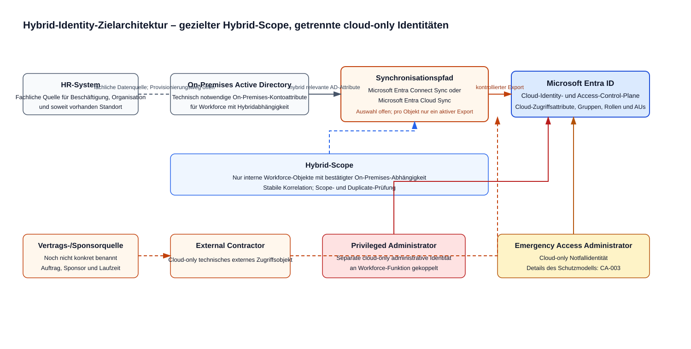

# Diagramm-Konventionen

## Ziel

Diagramme sind Teil der Architektur-Dokumentation und sollen komplexe IAM-Zusammenhänge schnell verständlich machen.

## Dateistruktur

```text
docs/diagrams/
├── source/
└── rendered/
```

### Source

Editierbare Quelldateien:

```text
docs/diagrams/source/identity-overview.drawio
```

### Rendered

Für GitHub direkt sichtbare Exporte:

```text
docs/diagrams/rendered/identity-overview.svg
```

## Geplante Diagramme

### DGM-001 – Unternehmens-/Standortmodell

Enthält:

- Zentrale Hamburg
- Lager Nord
- Lager Süd
- Filialen
- externe Dienstleister
- zentrale Identity-Plattform

### DGM-002 – Persona-/Identity-Modell

Enthält:

- Office User
- Warehouse User
- Store User
- External Contractor
- Privileged Administrator
- Emergency Access Administrator

### DGM-003 – Zielarchitektur

Enthält:

- Identity Sources
- Hybrid Identity
- Entra ID
- Anwendungen
- Governance
- Conditional Access
- Automation

### DGM-004 – Joiner/Mover/Leaver

Enthält:

- Source of Authority
- Provisioning
- Gruppen/Rollen
- Anwendungen
- Mover
- Offboarding

### DGM-005 – Conditional-Access-Modell

Enthält:

- Signale
- Benutzer-/Ressourcenkontext
- Geräte
- Risiko
- Grant Controls
- Ausnahmen

### DGM-006 – Application Onboarding

Enthält:

- Intake
- Architekturprüfung
- SAML/OIDC
- App Registration / Enterprise App
- Gruppen/App Roles
- SCIM
- Conditional Access
- Übergabe in Betrieb

### DGM-007 – Git / Drift Detection

Enthält:

- Repository
- Review
- Referenzkonfiguration
- Graph Export
- Compare
- Drift Report

## Designregeln

- maximal eine Hauptaussage pro Diagramm
- keine dekorativen Elemente ohne Informationswert
- konsistente Begriffe
- gleiche Komponenten in verschiedenen Diagrammen gleich benennen
- Deutsch für Fachtexte
- englische Microsoft-Produktnamen unverändert
- keine realen Firmendaten
- Diagramme müssen ohne Präsentation verständlich sein

## Einbindung in Markdown

Beispiel:

```md

```
